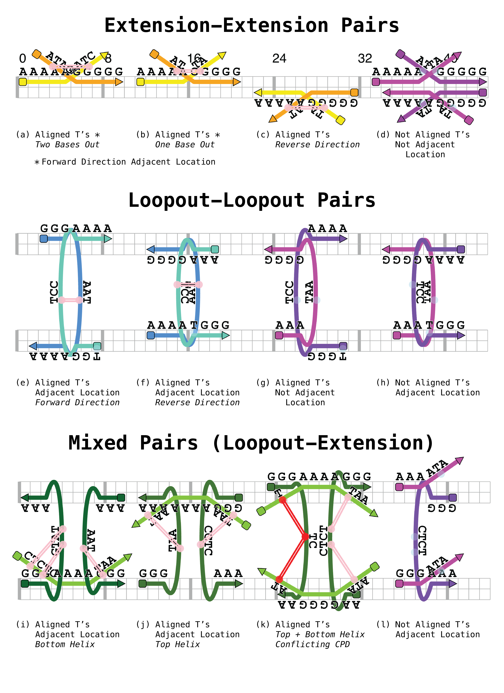
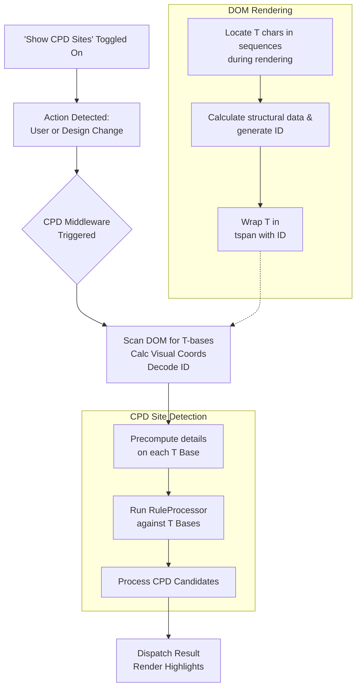
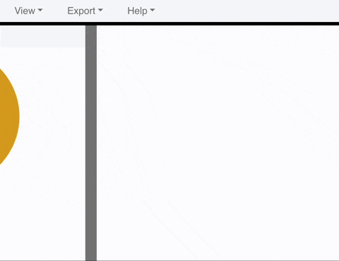
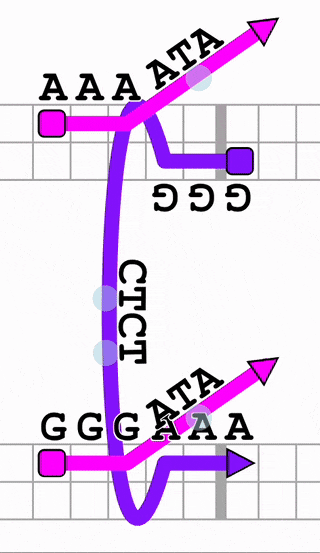

# CPD Site Detection Feature

This feature enables Scadnano to identify and visualize individual thymine (T) bases in DNA sequences and potential Cyclobutane Pyrimidine Dimer (CPD) formation sites. These CPD sites form between T bases under specific structural conditions, which the feature detects using declarative rules. 

## Table of Contents

- [High-Level Overview](#high-level-overview)
- [Detailed Breakdown](#detailed-breakdown)
  - [Stage 1. T-Base Detection](#stage-1-t-base-detection)
    - [1.1 Render Time: T-Base Tagging](#11-render-time-t-base-tagging)
    - [1.2 Scan Time: Data Collection and Coordinate Calculation](#12-scan-time-data-collection-and-coordinate-calculation)
  - [Stage 2. CPD Site Detection and Display](#stage-2-cpd-site-detection-and-display)
    - [2.1 Triggering CPD Detection](#21-triggering-cpd-detection)
    - [2.2 Detection Data Prep](#22-detection-data-prep)
    - [2.3 CPD Rule Engine](#23-cpd-rule-engine)
    - [2.4 CPD Site and T-Base UI Rendering](#24-cpd-site-and-t-base-ui-rendering)
- [How to Run](#how-to-run)
- [Known Issues](#known-issues)
- [Future Improvements](#future-improvements)

## High-Level Overview

The feature operates in two main stages:
**Stage 1. T-Base Detection:** During DNA sequence rendering, individual 'T' characters are wrapped in SVG `<tspan>` elements with encoded structural data. A subsequent scan collects these T-bases from the rendered application (the DOM), calculates their visual coordinates, and stores the information.

**Stage 2. CPD Site Detection and Display:** Using the collected T-base data, a rule engine evaluates predefined geometric and alignment rules to identify pairs of T-bases that are candidates for CPD formation. These sites are then processed for conflicts and stored for visualization.

The feature is currently supported by unit tests that check 12 different T-base pair configurations under three categories of pairing rules. The tests cover positive cases (where CPD sites should be detected) and negative cases (where CPD sites should not be detected).

<div align="center">
  
</div>


<div align="center">

### Process Flow Diagram

<div style="width:50%;">



</div>
</div>

## Detailed Breakdown

### Key Files

- **Data Structures:**
    - `lib/src/state/t_base_location.dart`: Defines `TBaseLocation` and `TBaseLocations`.
    - `lib/src/state/cpd_site.dart`: Defines `CPDSite` (a `TBaseLocation` pair and its conflict status).
- **Core Logic & Utilities:**
    - `lib/src/middleware/cpd_rule_helpers.dart`: CPD Rule Engine, including:
        - `IdentifiedTBase` and `TBaseData` classes
        - `RuleDefinition`, `TBaseCondition`, `PairCondition`, `RuleProcessor`, `detect_cpd_sites_from_t_bases`, `process_cpd_candidates`.
    - `lib/src/util/t_base_util.dart`: Functions for T-base processing, including:
        - `generateStableId`, `decodeStableId`, `calculateGridAnchorCoords`, `calculateVisualCoords`.
- **Actions & Reducers:**
    - `lib/src/actions/actions.dart`: Defines `DetectCPDSites` and `CPDDetectionResult`.
    - `lib/src/reducers/t_bases_reducer.dart`: Handles updates to `t_base_locations`.
    - `lib/src/reducers/app_ui_state_reducer.dart`: Handles `t_bases_reducer`, `cpd_sites`, `ShowCPDSitesContinuouslySet` and `ShowAllTBasesSet`.
- **Middleware:**
    - `lib/src/middleware/cpd_auto_trigger_middleware.dart`: Automatically dispatches `DetectCPDSites` or clears display highlights in response to UI menu toggles and user actions.
    - `lib/src/middleware/detect_cpd_sites.dart`: Intercepts `DetectCPDSites`, manages the T-base collection, and calls `detect_cpd_sites_from_t_bases`.
- **UI & Rendering:**
    - `lib/src/view/design_main_dna_sequence.dart`: Wraps 'T' characters in sequences with `<tspan>` elements that contain encoded structural IDs.
    - `lib/src/view/design_main_cpd_highlights.dart`: Renders visual highlights for CPD sites (paired T-bases with connecting lines), conflicted site status, and individual highlights on all identified T-bases.
    - `lib/src/view/menu.dart`: Includes the UI toggles for showing/hiding CPD site and T-base highlights.
- **Unit Tests:**
    - `test/cpd_rules/`: Contains unit tests for the CPD rule engine.
        - `ext_ext_rule_test.dart`: Tests CPD site detection between adjacent extensions.
        - `loopout_loopout_rule_test.dart`: Tests CPD site detection between adjacent loopouts.
        - `ext_loopout_rule_test.dart`: Tests CPD site detection between adjacent extensions and loopouts.

### Stage 1. T-Base Detection

#### 1.1 Render Time: T-Base Tagging

When DNA sequences are rendered by `lib/src/view/design_main_dna_sequence.dart`:
- If T-base scanning is active (driven by `props.scan_for_t_bases`), each 'T' character within domains, loopouts, extensions, or insertions is wrapped in an SVG `<tspan>` element.
- **Structural Data Calculation:** For each 'T', `t_base_util.calculateStructuralIdentificationData()` is called. This function determines properties like the strand ID, substrand type, logical index within the strand, precise offset within the substrand, and helix information.
- **ID Generation:** The result from `calculateStructuralIdentificationData` is used by `t_base_util.generateStableId()` to create a unique string ID (e.g., `tb-strandX-Domain-domainY-...`). This ID is assigned to the `<tspan>` element's `id` attribute.
- **Character Index:** A `data-char-idx` attribute is added to the `<tspan>` containing the 'T' character's 0-based index within its immediate parent text.

#### 1.2 Scan Time: Data Collection and Coordinate Calculation

When the `DetectCPDSites` action initiates a T-base scan, it triggers `_collect_t_bases_and_detect_cpds`:
- **DOM Query:** The design space SVG DOM is searched for all `<tspan>` elements whose `id` attribute starts with `tb-` using `querySelectorAll('tspan[id^="tb-"]')`.
- **Data Extraction and Processing (for each `<tspan>`):**
    - The `id` and `data-char-idx` are retrieved.
    - `t_base_util.decodeStableId()` parses the ID string back into a `StructuralIdentificationData` object.
    - `t_base_util.calculateVisualCoords()` calculates the rendered on-screen coordinates of the 'T' character wrapped in the `<tspan>`.
        - The rendered location of each 'T' base is not stored in the application state. Trying to directly querying a `<tspan>`'s global location within the final rendered SVG DOM will not return the correct result due to parent element transforms that are only applied at render time.
        - Instead, the function retrieves the local position and SVG transforms (mainly rotation information) for the `<tspan>`, its parent `<text>` or `<textPath>` element, and all parent elements up to the design space SVG DOM root. It then merges all parent element transforms to establish a global location context. This context is applied to the `<tspan>`'s local position to determine its final global location in the SVG DOM. This determines the position for the pink and blue highlight circles.
    - `t_base_util.calculateGridAnchorCoords()` determines a grid-based anchor point for the T-base related to its position on the DNA helix grid.
    - An `IdentifiedTBase` object is created, storing the `source_id` (the ID from the DOM), direct references to the `Strand` and `Substrand` objects, `idx_in_substrand_sequence`, and the calculated visual and grid coordinates.

### Stage 2. CPD Site Detection and Display

#### 2.1 Triggering CPD Detection

<div align="center">
  
</div>

- **User Toggles:** Enabling "Show CPD Sites" in the "View" menu dispatches `actions.ShowCPDSitesContinuouslySet(true)`.
- **Triggers:** In `lib/src/middleware/cpd_auto_trigger_middleware.dart`:
    - Listens for design modifying Actions (if "Show CPD" is enabled):
        - `LoadDNAFile`
        - `AssignDNA`, `RemoveDNA`
        - `Undo`, `Redo`, `DeleteAllSelected`
        - `ConvertCrossoverToLoopout`
        - `DeletionAdd`, `DeletionRemove`
        - `InsertionAdd`, `InsertionRemove`
        - `InsertionLengthChange`, `LoopoutLengthChange`
        - `ExtensionNumBasesChange`, `ExtensionDisplayLengthAngleSet`
        - `StrandsMoveCommit`, `DNAEndsMoveCommit`, `DNAExtensionsMoveCommit`
    - Dispatches `DetectCPDSites` on detection of any of the above Actions.
    - Turns off the display of CPD sites and T-bases if the display of their dependent DNA sequences is also turned off.

#### 2.2 Detection Data Prep

When a collected list of `IdentifiedTBase` is passed to `detect_cpd_sites_from_t_bases`:
- **Input:** Receives the `Design` object and `List<IdentifiedTBase>`.
- **Create TBaseData:** A more detailed `TBaseData` object is created from `IdentifiedTBase`:
    - `Strand` and `Substrand` object references.
    - `idx_in_substrand` and `substrand_length` calculations.
    - `SubstrandTypeEnum` (DOMAIN, EXTENSION, LOOPOUT).
    - Pre-computed anchor helix index and offset, parent domain direction, and effective distance information.
    - Visual and grid coordinates.

#### 2.3 CPD Rule Engine

The rule engine in `lib/src/middleware/cpd_rule_helpers.dart` is passed the list of `TBaseData` objects, and then `RuleProcessor.process_rules` is called on this list. The two main concepts in the CPD site formation rules for off-helix T-bases are **Adjacency** and **Alignment**.

1. **Geometric Adjacency:** Two off-helix features demonstrate geometric adjacency if they are anchored to a common helix at neighboring offsets and their parent strands travel in the same direction (`forward` property).
2. **T-Alignment:** Two T-bases are considered aligned if they have the same **Effective Distances** from their respective anchor points.
**Effective Distance:** A 0-indexed count of bases when moving outward from the anchor point along a sequence path.
    - **For Extensions: `eff_dist_E()`**
        - 5' Extension Anchor: `eff_dist_E = idx_in_substrand`
        - 3' Extension Anchor: `eff_dist_E = substrand_length - 1 - idx_in_substrand`
    - **For Loopouts: `eff_dist_L()`:**
        - 5' Loopout Anchor: `eff_dist_L = idx_in_substrand`
        - 3' Loopout Anchor: `eff_dist_L = substrand_length - 1 - idx_in_substrand`

##### Rule Definitions

- **Condition**: A property used in a Rule to help determine if a match is detected. Conditions exist for both individual T-Bases and Pairs of T-Bases. Conditions encapsulate detection logic, making Rules more human-readable.

- **Rule**: A declarative collection of Individual and Pair Conditions that signals a potential CPD Site when a pair of T-Bases passes all conditions. The Rule Engine narrow downs the search space by using individual T-Base conditions to pre-filter the list of potential pairs.


The current Rules defined in `lib/src/middleware/cpd_rule_helpers.dart`:
**1) Adjacent Extensions, Perfectly Aligned T-Bases:**
```dart
final adjacentExtensionRule = RuleDefinition(
    ruleName: "AdjacentPerfectlyAlignedExtensions",
    t1_conditions: [IsOnExtensionCondition()],
    t2_conditions: [IsOnExtensionCondition()],
    pair_conditions: [
    AreNotOnSameStrandCondition(),
    AreOnSameHelixCondition(),
    AreParentDomainsSameDirectionCondition(),
    AdjacentExtensionsAlignedPairCondition(),
    ],
    score: 1.0,
);
```

**2) Adjacent Loopouts, Perfectly Aligned T-Bases:**
```dart
final adjacentLoopoutRule = RuleDefinition(
    ruleName: "AdjacentPerfectlyAlignedLoopouts",
    t1_conditions: [IsOnLoopoutCondition()],
    t2_conditions: [IsOnLoopoutCondition()],
    pair_conditions: [
    AreNotOnSameStrandCondition(),
    AdjacentLoopoutsAlignedPairCondition(),
    ],
    score: 1.0,
);
```

**3) Adjacent Extensions-Loopouts, Perfectly Aligned T-Bases:**
```dart
final extensionLoopoutRule = RuleDefinition(
    ruleName: "AdjacentExtensionLoopoutPerfectlyAligned",
    t1_conditions: [IsOnExtensionCondition() || IsOnLoopoutCondition()],
    t2_conditions: [IsOnExtensionCondition() || IsOnLoopoutCondition()],
    pair_conditions: [
    AreNotOnSameStrandCondition(),
    AdjacentExtensionLoopoutAlignedPairCondition(),
    ],
    score: 1.0,
);
```

##### Conflict Resolution

- **Conflict Resolution:** The `process_cpd_candidates` function processes candidate pairs identified by the Rule Engine. If a T-base is part of multiple candidate pairs, all pairs involving that T-base are marked as `is_conflicted = true`.
- **Preparation:** The processed pairs are saved as `BuiltList<CPDSite>`, with each `CPDSite` containing two `TBaseLocation` objects and the `is_conflicted` flag.
- **Output Results:** The `CPDDetectionResult` action is dispatched with the results.


#### 2.4 CPD Site and T-Base UI Rendering

The `cpd_sites_reducer` updates `AppUIState.cpd_sites`:
- `DesignMainCPDHighlights` reads `AppUIState.cpd_sites`. If CPD site display is enabled, it renders:
    - Pink circles at the visual coordinates of T-bases in non-conflicted CPD sites.
    - Red circles for T-bases in conflicted CPD sites.
    - Two parallel lines connect the visual positions of the paired T-bases (pink for non-conflicted, red for conflicted).
- If "Show All T Bases" is also enabled, light blue circles are rendered for all unpaired T-bases.

<div align="center">
  
</div>

## How to Run

1. **Install the Dart SDK**
   *For Mac (using Homebrew):*
   ```bash
   brew tap dart-lang/dart
   brew install dart
   ```
   *For Windows:*
   - Download the Dart SDK installer from [dart.dev](https://dart.dev/get-dart). Add Dart to your PATH if the installer didn't.

2. **Clone the Repository**
   ```bash
   git clone https://github.com/travisformayor/scadnano_cpd.git
   cd scadnano
   ```

3. **Install Dependencies**
   ```bash
   # Download packages
   dart pub get
   # Install webdev
   dart pub global activate webdev
   ```

4. **Run the Server**
   ```bash
   # Build the project
   dart run build_runner build --delete-conflicting-outputs
   # Run the local server (http://localhost:8080)
   webdev serve
   ```

5. **Load Example Design**
    - Open the example design located in the repo at `cpd-site-docs/example_designs/cpd_test_cases.sc`
    - Enable View -> DNA -> "DNA sequences"
    - Enable View -> CPD -> "Show CPD Sites" and "Show All T-Bases"

6. **Running Unit Tests**
    ```bash
    # Running just the CPD unit tests
    dart run build_runner test -- test/cpd_rules/ext_ext_rule_test.dart
    dart run build_runner test -- test/cpd_rules/ext_loopout_rule_test.dart
    dart run build_runner test -- test/cpd_rules/loopout_loopout_rule_test.dart
    # Running all unit tests
    dart run build_runner test
    ```

## Known Issues

- **Complex calculateGridAnchorCoords():** The `calculateGridAnchorCoords` function in `lib/src/util/t_base_util.dart`, which contains complex logic for loopouts and extensions, may no longer be necessary. Its removal would require a minor refactor.
- **Precomputation Error Handling:** Currently if errors occur during data collection and pre-computation for a T-Base it is skipped to prevent halting the scanning process. Skipping T-Bases can hide issues and could lead to incomplete CPD detection. Improved error handling is needed.
- **Insertion/Deletion in T-Base Detection:** The `calculateStructuralIdentificationData` function does not correctly handle insertions or deletions within parent Domain strands when calculating `helix_offset`.
- **Direct State Access:** Methods in `lib/src/view/design_main_dna_sequence.dart` directly access global state within their rendering logic to retrieve T-Base Design information. Passing this information via props would be a better approach but would require a large refactor.
- **Loopout-Loopout Anchor Conditional:** For loopouts to be considered adjacent, they currently need to match on both anchor points. However, the current Condition allows for adjacency if only one set of anchor points matches.
- **SVG Export:** Changes to the DOM to enable locating rendered T-Base position are not supported by the existing Scadnano SVG Export tool. Ideally, this issue will be resolved not by modifying the SVG Export code, but by implementing the T-Base identification marker improvements described in the Future Improvements section.

## Future Improvements

- **Refactor T-Base Identification Markers:** Instead of wrapping each 'T' in a `<tspan>` with structural information encoded in the ID, use the parent `<text>`/`<textPath>` elements as the DOM location marker and store any structural and character position information in a data attribute. This change would simplify the DOM, shift some T-specific offset calculations to scan time, and resolve the SVG Export issue.
- **RuleProcessor Optimization:** Update the pairing algorithm for improved runtime complexity on large designs.
- **Condition Granularity:** Break larger Conditions in the Rule Engine up into smaller and more reusable components. For example, turn the `AdjacentExtensionLoopoutAlignedPairCondition` into the `AdjacentExtensionLoopout` and `AlignedPairCondition` Conditions.
- **Scoring Based on Experimental Values:** Update `RuleDefinition.score` to support probabilistic results based on experimental data, and incorporate additional Conditions derived from that same data.
- **Unit Test Expansion (CPD specific):** Expand unit testing for CPD rules to cover more diverse configuration scenarios, and add dedicated unit tests for individual helper functions.
